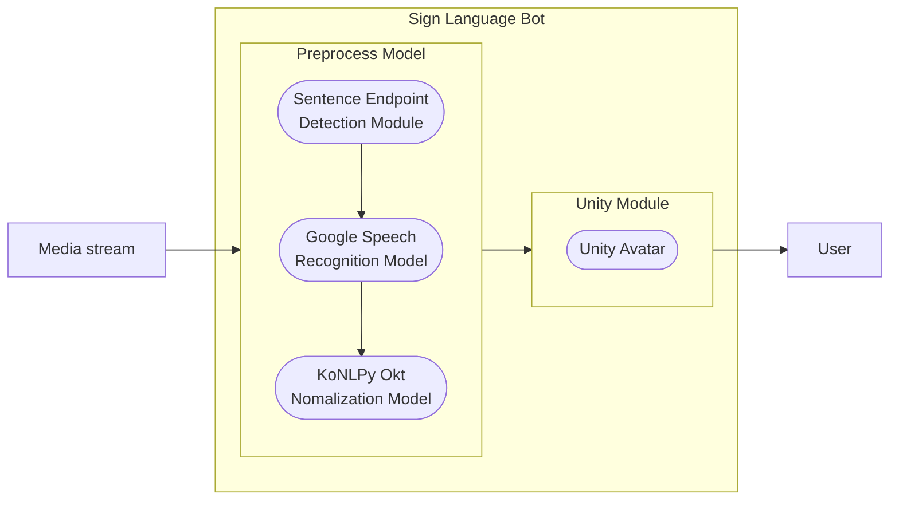

  <h1>sign_language_bot</h1>
  
수어 아바타를 통해 미디어로부터 수어를 생성해내는 프로젝트

   

 

<h2>요약</h2>

  이 프로젝트는 한국어 실시간 양방향 수어 번역을 지원하는 모델에서 미디어로부터 수어로의 방향의 번역을 지원하고자 만들어진 프로젝트이다. 음성 및 자연어 모델을 통해 실시간 미디어 스트림으로부터 텍스트 형태의 정규화된 단어를 추출하고 3D 엔진으로 제작한 아바타가 이를 수어로 표현한다.

<h2>구조</h2>

<ul>
  <li>
    <h3>Sentence Endpoint Detection Module</h3>
    한국어 음성이 포함된 미디어 스트림에서 음성을 추출하고 볼륨 변화를 감지하여, 발화의 끝마다 음성을 분할해 입력으로 사용한다.
  </li>
  <li>
    <h3>Google Speech Recognition Model</h3>
    구글의 음성 인식 API를 사용해 음성 데이터를 텍스트 데이터로 변환한다.
  </li>
  <li>
    <h3>KoNLPy Okt Nomalization Model</h3>
    KoNLPy의 Okt 모델을 사용해 활용이 일어난 한국어 단어들을 기본형으로 전환한다.
  </li>
  <li>
    <h3>Unity Avatar</h3>
    Unity 3D 엔진으로 제작된 아바타가 각 단어에 대응되는 수어 애니메이션을 재생한다.
  </li>
</ul>

<h2>참고</h2>
<blockquote>
  
이 프로젝트는 숭실대학교 "캡스톤 디자인 종합설계" 수업에서 진행한 "LSTM과 3D 모델링을 활용한 실시간 양방향 수어 번역 모델" 연구의 일환으로서 제작되었습니다. 전체 연구에 대한 리포지토리는 <a href="https://github.com/legatalee/Sign-Language-Translation">이곳</a>을 참조하세요.

</blockquote>
